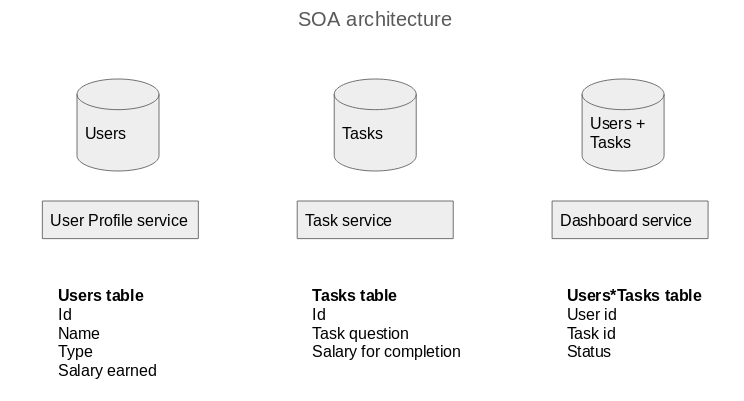

# CrowdMentor
Dr.Korok Ray is the director of the Mays Innovation Research Center, and his core area of research is the study of incentive, risk and
reward for human performance. As part of his research, he wants to study how the workers' performance can be improved in a crowdsourcing
environment. The goal of this project is to build a crowdsourcing website which would allow the collection of real world data necessary for
his research.

The website must allow the admins to upload tasks and workers to complete them. Each worker is assigned a
mentor who guides him through the task. The worker earns a salary for each task he completes. Completed tasks are randomly chosen for 
audits and checked for correctness. Based on the audits, the workers either receive a bonus which adds to their salary or a penalty which
subtracts from it. The audits also help evaluate the workers' performance, which helps determine the effectiveness of the training and
incentives being provided to the them. The goal is to build a system where the factors which affect worker performance can be studied
comprehensively.

Iteration 1 : Task Updater(TU) submits the task, Worker completes the task and earns salary.\\
For the first iteration, we have a simple question answering task where the worker must answer the question.

Testing User Stories
Like Cucumber, we have a package called behave which captures user requirements in plain English and maps them to test code written in Python. However, the Django framework does not provide a "Capybara" which acts as the user during testing. Instead, we are using a headless browser(a web browser without a GUI) and interacting with it using a webdriver which lets us simulate user actions like clicking buttons or following urls. The headless browser we are using is called PhantomJS and the webdriver is called Splinter, these along with behave are used to test the user stories.
Also, we are using Factory Boy to create the data to be included the test database. For eg, the users are created in this way for testing the login feature of the website.

